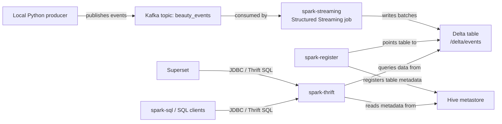

# Kafka + Spark + Delta + Superset

This project streams beauty user events from Kafka into a Delta Lake table with Spark Structured Streaming, registers that table in a Hive metastore, and exposes it through Spark Thrift Server for SQL tools like Superset.

## Architecture



## Services

- `zookeeper`: Kafka coordination
- `kafka`: event broker with internal Docker access on `kafka:9092` and host access on `localhost:29092`
- `spark-master`: Spark standalone master
- `spark-worker`: Spark standalone worker
- `spark-streaming`: consumes Kafka and writes Delta data to `/delta/events`
- `hive-metastore`: metadata service backed by embedded Derby
- `spark-register`: one-shot Spark job that registers `beauty_events` in the metastore
- `spark-thrift`: Spark SQL Thrift/JDBC endpoint on port `10000`
- `jupyter`: JupyterLab workspace for creating notebooks on port `8888`
- `fastapi`: starter inference API on port `8000`
- `superset`: BI UI on port `8088`

## Runtime Flow

1. `kafka_producer_user_events.py` sends JSON messages to Kafka topic `beauty_events`.
2. `spark-streaming` reads from Kafka with Structured Streaming.
3. The stream parses the event payload and writes it to the Delta table at `/delta/events`.
4. `spark-register` creates the metastore entry for table `beauty_events`.
5. `spark-thrift` exposes that registered table over JDBC/Thrift.
6. Superset or `spark-sql` can query `default.beauty_events`.

## Start The Stack

Build the custom Spark image first:

```bash
docker compose build spark-master
```

Start the core services:

```bash
docker compose up -d zookeeper kafka hive-metastore spark-master spark-worker
docker compose up -d spark-thrift
docker compose up spark-register
docker compose up -d spark-streaming jupyter superset
```

Open JupyterLab in your browser:

```text
http://localhost:8888
```

This local development setup disables the Jupyter token so the notebook opens directly on your machine.

## Recommended Notebook Learning Order

Here is the recommended order to learn in this repo:

1. [notebooks/README.md](/Users/leninmookiah/Downloads/workspace/kafka-spark-docker/notebooks/README.md) for the overview and problem map.
2. [notebooks/identity_resolution.ipynb](/Users/leninmookiah/Downloads/workspace/kafka-spark-docker/notebooks/identity_resolution.ipynb) for identity graph concepts, match rate, signal loss, and stitching.
3. [notebooks/exposure_conversion_join.ipynb](/Users/leninmookiah/Downloads/workspace/kafka-spark-docker/notebooks/exposure_conversion_join.ipynb) for exposure to conversion joins and attribution windows/rules.
4. [notebooks/marketing_attribution.ipynb](/Users/leninmookiah/Downloads/workspace/kafka-spark-docker/notebooks/marketing_attribution.ipynb) for channel attribution, ROI/ROAS/CPA, and budget allocation.
5. [notebooks/ctr_calibration.ipynb](/Users/leninmookiah/Downloads/workspace/kafka-spark-docker/notebooks/ctr_calibration.ipynb) for CTR modeling, calibration, and bidding impact.
6. [notebooks/telco_customer_churn_marketing.ipynb](/Users/leninmookiah/Downloads/workspace/kafka-spark-docker/notebooks/telco_customer_churn_marketing.ipynb) for uplift modeling, T/X/S learners, Qini, and deciles.

This flow builds logically:
identity -> joins -> attribution -> optimization/reporting -> modeling/calibration -> uplift.

## ML And MLOps Tooling

The notebook image now includes:

- `mlflow` including Model Registry support
- `wandb`
- `dvc`
- `fastapi`
- `uvicorn`
- `evidently`
- `whylogs`
- `whylabs-client`
- `prometheus-client`

FastAPI starter endpoint:

```text
http://localhost:8000/health
```

FastAPI Prometheus metrics:

```text
http://localhost:8000/metrics
```

## Optional Serving And Monitoring Services

TensorFlow Serving, TorchServe, and Prometheus are available through Compose profiles so they do not interfere with the default analytics stack before you add models or monitoring targets.

Start serving tools:

```bash
docker compose --profile serving up -d tensorflow-serving torchserve
```

Start Prometheus:

```bash
docker compose --profile monitoring up -d prometheus
```

Prometheus UI:

```text
http://localhost:9090
```

TensorFlow Serving endpoints:

```text
gRPC: localhost:8500
REST: http://localhost:8501
```

TorchServe endpoints:

```text
Inference: http://localhost:9181
Management: http://localhost:9182
Metrics: http://localhost:9183
```

Notes:

- TensorFlow Serving expects a SavedModel under [models/tensorflow](/Users/leninmookiah/Downloads/workspace/kafka-spark-docker/models/tensorflow).
- TorchServe expects `.mar` archives in [models/torchserve/model-store](/Users/leninmookiah/Downloads/workspace/kafka-spark-docker/models/torchserve/model-store).
- MLflow Model Registry is part of the installed `mlflow` package. For local notebook work, you can point MLflow to a tracking backend and use the registry APIs directly from Python.

## Produce Test Data

Run the producer locally:

```bash
python3 kafka_producer_user_events.py
```

If you want to inspect raw Kafka messages separately, use:

```bash
python3 kafka_consumer_user_events.py
```

## Verify Data End To End

Open Spark SQL from the running Thrift container:

```bash
docker exec -it spark-thrift /opt/spark/bin/spark-sql \
  --conf spark.hadoop.hive.metastore.uris=thrift://hive-metastore:9083 \
  --conf spark.sql.extensions=io.delta.sql.DeltaSparkSessionExtension \
  --conf spark.sql.catalog.spark_catalog=org.apache.spark.sql.delta.catalog.DeltaCatalog
```

Then run:

```sql
SHOW TABLES;
SELECT * FROM beauty_events LIMIT 10;
```

## Superset Connection

Use Spark Thrift Server as the database:

```text
hive://spark-thrift:10000/default?auth=NOSASL
```

If you are connecting from outside Docker, use:

```text
hive://localhost:10000/default?auth=NOSASL
```

## Notes On Superset

- The generic `pyhive` connector does not fully understand Spark Thrift's `SHOW TABLES` response shape out of the box.
- This repo includes [sitecustomize.py](/Users/leninmookiah/Downloads/workspace/kafka-spark-docker/sitecustomize.py), which patches `pyhive` inside the Superset container so table introspection works correctly.
- If you change [Dockerfile.superset](/Users/leninmookiah/Downloads/workspace/kafka-spark-docker/Dockerfile.superset), rebuild Superset with:

```bash
docker compose build superset
docker compose up -d --force-recreate superset
```

## Important Paths

- Delta table location: `/delta/events`
- Spark warehouse directory: `/delta/warehouse`
- Streaming checkpoint: `/tmp/events_checkpoint`
- Local notebooks directory: [notebooks](/Users/leninmookiah/Downloads/workspace/kafka-spark-docker/notebooks)
- Notebook mount inside Spark containers: `/opt/spark/notebooks`
- Spark jobs mounted into containers from: [spark_jobs](/Users/leninmookiah/Downloads/workspace/kafka-spark-docker/spark_jobs)

## Current Table Schema

The streaming job currently writes these columns:

- `username`
- `action`
- `timestamp`
- `event_date`

The local producer emits richer payloads than the current streaming schema. If you want those additional product and address fields queryable in Delta/Superset, expand the schema in [streaming_job.py](/Users/leninmookiah/Downloads/workspace/kafka-spark-docker/spark_jobs/streaming_job.py).

## Operational Notes

- `spark-register` is expected to exit with code `0` after registration. It is a one-shot setup job, not a long-running service.
- `spark-thrift` is intentionally limited with `spark.cores.max=4` so it does not starve `spark-streaming` on the single worker.
- The metastore uses embedded Derby, so this stack is aimed at local development rather than production durability.
- Validation with `spark-sql` is more reliable here than Beeline from Hive 4, because Spark 3.5 Thrift Server is Hive 2.3-oriented.

## Common Commands

Recreate the Spark services after config changes:

```bash
docker compose up -d --force-recreate spark-master spark-worker spark-thrift spark-streaming
docker compose up spark-register
```

Open a shell in a Spark container and access mounted notebooks:

```bash
docker exec -it spark-master bash
ls /opt/spark/notebooks
```

Build or refresh the notebook service after notebook image changes:

```bash
docker compose build jupyter
docker compose up -d --force-recreate jupyter
```

Tail useful logs:

```bash
docker logs -f spark-streaming
docker logs -f spark-thrift
docker logs spark-register
docker logs superset
```

## Next Improvements

1. Expand the schema in [streaming_job.py](/Users/leninmookiah/Downloads/workspace/kafka-spark-docker/spark_jobs/streaming_job.py) so Delta and Superset expose the full producer payload, including product and delivery fields.
2. Replace the embedded Derby metastore with an external database-backed metastore for better durability.
3. Add more Spark worker capacity or separate resource pools so `spark-thrift` and `spark-streaming` do not compete on a single worker.
4. Add stronger health checks and service readiness handling so startup is less timing-sensitive.
5. Add Delta maintenance tasks such as retention policy, checkpoint review, and compaction strategy as data volume grows.
6. Make Superset provisioning declarative so the database connection and datasets can be created automatically.
7. Add a simple smoke test that produces an event, validates registration, and confirms `beauty_events` is queryable.
