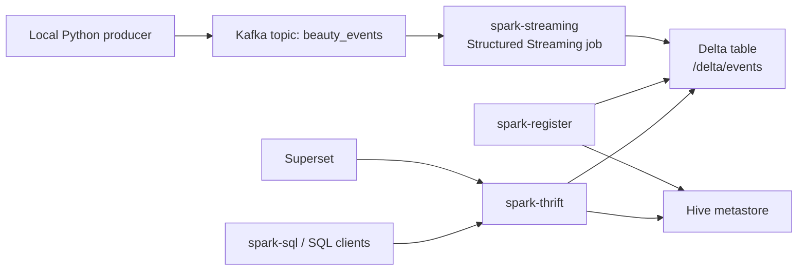

# Kafka + Spark + Delta + Superset

This project streams beauty user events from Kafka into a Delta Lake table with Spark Structured Streaming, registers that table in a Hive metastore, and exposes it through Spark Thrift Server for SQL tools like Superset.

## Architecture



## Services

- `zookeeper`: Kafka coordination
- `kafka`: event broker with internal Docker access on `kafka:9092` and host access on `localhost:29092`
- `spark-master`: Spark standalone master
- `spark-worker`: Spark standalone worker
- `spark-streaming`: consumes Kafka and writes Delta data to `/delta/events`
- `hive-metastore`: metadata service backed by embedded Derby
- `spark-register`: one-shot Spark job that registers `beauty_events` in the metastore
- `spark-thrift`: Spark SQL Thrift/JDBC endpoint on port `10000`
- `superset`: BI UI on port `8088`

## Runtime Flow

1. `kafka_producer_user_events.py` sends JSON messages to Kafka topic `beauty_events`.
2. `spark-streaming` reads from Kafka with Structured Streaming.
3. The stream parses the event payload and writes it to the Delta table at `/delta/events`.
4. `spark-register` creates the metastore entry for table `beauty_events`.
5. `spark-thrift` exposes that registered table over JDBC/Thrift.
6. Superset or `spark-sql` can query `default.beauty_events`.

## Start The Stack

Build the custom Spark image first:

```bash
docker compose build spark-master
```

Start the core services:

```bash
docker compose up -d zookeeper kafka hive-metastore spark-master spark-worker
docker compose up -d spark-thrift
docker compose up spark-register
docker compose up -d spark-streaming superset
```

## Produce Test Data

Run the producer locally:

```bash
python3 kafka_producer_user_events.py
```

If you want to inspect raw Kafka messages separately, use:

```bash
python3 kafka_consumer_user_events.py
```

## Verify Data End To End

Open Spark SQL from the running Thrift container:

```bash
docker exec -it spark-thrift /opt/spark/bin/spark-sql \
  --conf spark.hadoop.hive.metastore.uris=thrift://hive-metastore:9083 \
  --conf spark.sql.extensions=io.delta.sql.DeltaSparkSessionExtension \
  --conf spark.sql.catalog.spark_catalog=org.apache.spark.sql.delta.catalog.DeltaCatalog
```

Then run:

```sql
SHOW TABLES;
SELECT * FROM beauty_events LIMIT 10;
```

## Superset Connection

Use Spark Thrift Server as the database:

```text
hive://spark-thrift:10000/default?auth=NOSASL
```

If you are connecting from outside Docker, use:

```text
hive://localhost:10000/default?auth=NOSASL
```

## Notes On Superset

- The generic `pyhive` connector does not fully understand Spark Thrift's `SHOW TABLES` response shape out of the box.
- This repo includes [sitecustomize.py](/Users/leninmookiah/Downloads/workspace/kafka-spark-docker/sitecustomize.py), which patches `pyhive` inside the Superset container so table introspection works correctly.
- If you change [Dockerfile.superset](/Users/leninmookiah/Downloads/workspace/kafka-spark-docker/Dockerfile.superset), rebuild Superset with:

```bash
docker compose build superset
docker compose up -d --force-recreate superset
```

## Important Paths

- Delta table location: `/delta/events`
- Spark warehouse directory: `/delta/warehouse`
- Streaming checkpoint: `/tmp/events_checkpoint`
- Spark jobs mounted into containers from: [spark_jobs](/Users/leninmookiah/Downloads/workspace/kafka-spark-docker/spark_jobs)

## Current Table Schema

The streaming job currently writes these columns:

- `username`
- `action`
- `timestamp`
- `event_date`

The local producer emits richer payloads than the current streaming schema. If you want those additional product and address fields queryable in Delta/Superset, expand the schema in [streaming_job.py](/Users/leninmookiah/Downloads/workspace/kafka-spark-docker/spark_jobs/streaming_job.py).

## Operational Notes

- `spark-register` is expected to exit with code `0` after registration. It is a one-shot setup job, not a long-running service.
- `spark-thrift` is intentionally limited with `spark.cores.max=4` so it does not starve `spark-streaming` on the single worker.
- The metastore uses embedded Derby, so this stack is aimed at local development rather than production durability.
- Validation with `spark-sql` is more reliable here than Beeline from Hive 4, because Spark 3.5 Thrift Server is Hive 2.3-oriented.

## Common Commands

Recreate the Spark services after config changes:

```bash
docker compose up -d --force-recreate spark-master spark-worker spark-thrift spark-streaming
docker compose up spark-register
```

Tail useful logs:

```bash
docker logs -f spark-streaming
docker logs -f spark-thrift
docker logs spark-register
docker logs superset
```
